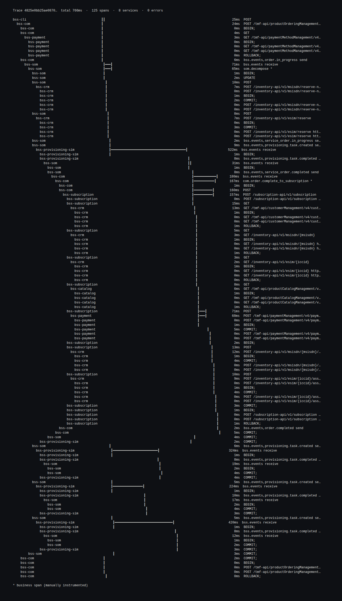
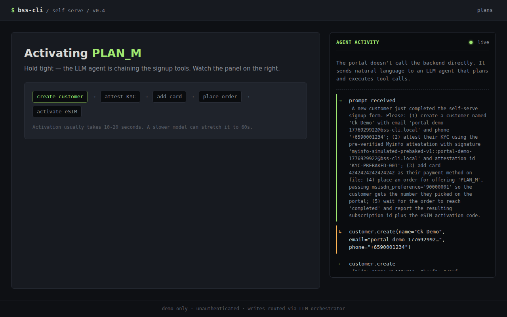
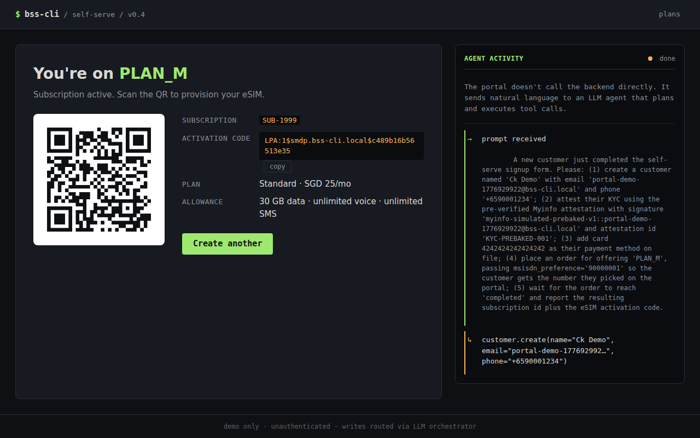
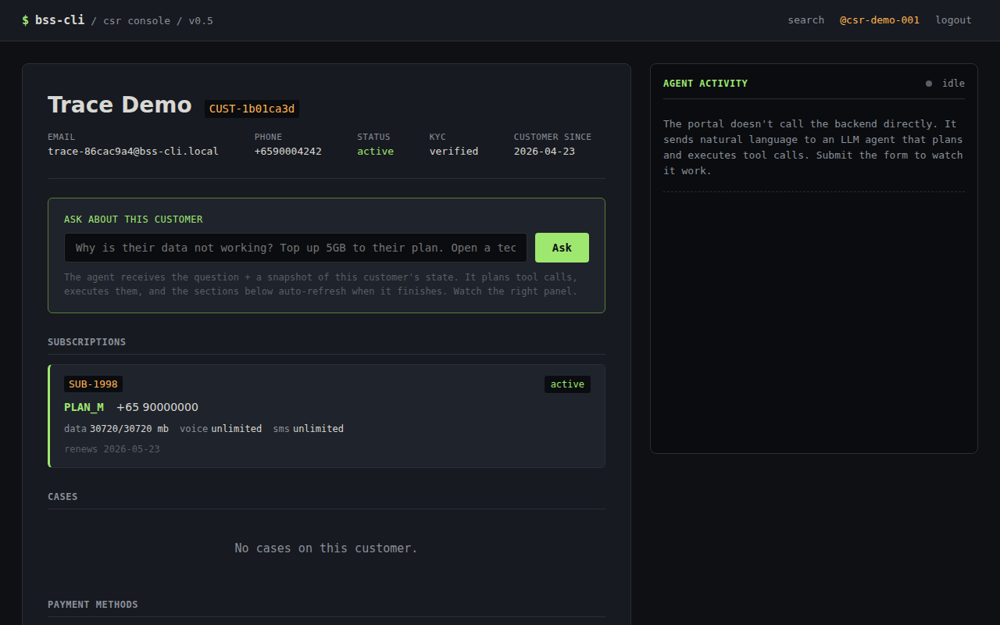
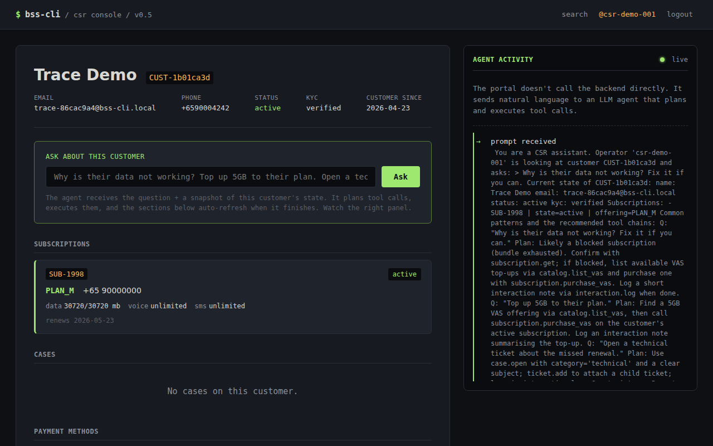

# BSS-CLI

> The entire BSS, in a terminal. SID-aligned. TMF-compliant. LLM-native. eSIM-first.

## What this is

A complete reference Business Support System for a small mobile prepaid MVNO, designed to run from a single terminal command. Nine TMF-compliant services (Catalog, CRM with Cases/Tickets, Payment, COM, SOM, Subscription, Mediation, Rating, Provisioning-sim) plus two web portals (self-serve signup, CSR console). Every operation is a tool the LLM can call; the primary UI is the `bss` CLI plus ASCII visualizations and live agent log streams in the portals. Metabase is the only graphical surface, reserved for analytics.

For engineers learning telco BSS/OSS, for a small MVNO that wants a deployable MVP, and as a substrate for agentic experiments against realistic telco operations. eSIM-only, bundled-prepaid, block-on-exhaust, card-on-file mandatory. eKYC, real-customer UI, network elements, batch CDR, and OCS protocols are intentionally out of scope.

## Screenshots

- **`bss trace` swimlane** — distributed trace of a signup chain, ASCII rendered in the terminal:
  
- **Self-serve portal — signup form mid-stream** — agent log shows tool calls landing while the form is still on screen:
  
- **Self-serve portal — confirmation** — eSIM QR PNG + LPA activation code:
  
- **CSR console — customer 360 with blocked subscription**:
  
- **CSR console — operator's ask mid-stream** — agent diagnosing + remediating a blocked subscription:
  

## The LLM agent story

Every write in BSS-CLI is reachable as a typed tool. Reads go direct (a `customer.get` doesn't need an LLM). For writes, BSS-CLI separates **deterministic routine flows** (direct, sub-second, deterministic) from **judgment-required flows** (orchestrator-mediated, LLM-reasoning, slower):

- **Direct via `bss-clients`** — every CLI/REPL command, the entire signup funnel (v0.11+), every post-login self-serve route (v0.10+), and every read.
- **Orchestrator-mediated via `astream_once`** — the CSR `/ask` agent surface and the self-serve chat route (when it lands in v0.12+). These wrap a LangGraph ReAct agent over the same tool registry as the direct path; the same policy chokepoint enforces both, so audit + attribution stay coherent.

The point: every BSS write goes through the per-service policy layer no matter which path triggered it. The audit log gets a coherent attribution (`channel=portal-self-serve`, `channel=portal-csr`, `channel=cli`, or `channel=llm`), and on the agent-mediated surfaces the **Agent Activity** widget makes the agent's tool-call sequence visible in real time.

Example: a CSR types *"why is their data not working — fix it if you can"*. The agent reads `subscription.get` → sees `state=blocked` → reads `catalog.list_vas` → calls `subscription.purchase_vas(VAS_DATA_5GB)` → calls `interaction.log("topped up after exhaustion")`. The 360 view auto-refreshes when the agent finishes, the operator sees `state=active` again, and `interaction.list` shows the action attributed to them — not to the model.

## Quick start

### Prerequisites

- Docker + Docker Compose
- Python 3.12 + [uv](https://docs.astral.sh/uv/)
- An OpenRouter API key (or any OpenAI-compatible endpoint) for `bss ask` and the portal agent flows

### Bring-your-own-infra (BYOI)

For a host that already has Postgres 16, RabbitMQ 3.13, and (optionally) Jaeger reachable.

```bash
git clone <repo>
cd bss-cli
cp .env.example .env

# Generate a real BSS_API_TOKEN; the sentinel value rejects on startup.
sed -i "s/^BSS_API_TOKEN=changeme$/BSS_API_TOKEN=$(openssl rand -hex 32)/" .env

# Edit .env: BSS_DB_URL, BSS_RABBITMQ_URL, BSS_LLM_API_KEY,
# optionally BSS_OTEL_EXPORTER_OTLP_ENDPOINT (e.g. http://tech-vm:4318)

docker compose up -d        # 9 services + 2 portals
make migrate                 # Alembic on the existing Postgres
make seed                    # 3 plans + 3 VAS offerings + MSISDN/eSIM pools
bss scenario run scenarios/customer_signup_and_exhaust.yaml
open http://localhost:9001/  # self-serve signup
```

### All-in-one (bundled infra)

For a fresh host with nothing else running.

```bash
docker compose -f docker-compose.yml -f docker-compose.infra.yml up -d
make migrate
make seed
bss scenario run scenarios/customer_signup_and_exhaust.yaml
open http://localhost:9001/   # self-serve signup
open http://localhost:9002/   # CSR console (any credentials)
open http://localhost:16686/  # Jaeger UI
open http://localhost:3000/   # Metabase
```

### First commands worth running

```bash
make scenarios-hero              # 6 hero scenarios — sanity-check the install
bss ask 'Show me the most recent customer.'
bss subscription show SUB-0001
bss trace for-order ORD-0001
```

## Documentation map

- [`CLAUDE.md`](CLAUDE.md) — project doctrine; read first
- [`ARCHITECTURE.md`](ARCHITECTURE.md) — topology, call patterns, deployability matrix, AWS path
- [`DATA_MODEL.md`](DATA_MODEL.md) — schemas + tables + relationships
- [`TOOL_SURFACE.md`](TOOL_SURFACE.md) — every LLM tool with arg shape and return shape
- [`DECISIONS.md`](DECISIONS.md) — non-obvious architectural choices, append-only
- [`CONTRIBUTING.md`](CONTRIBUTING.md) — *(new in v0.6)* phase discipline, DECISIONS pattern, test conventions
- [`ROADMAP.md`](ROADMAP.md) — *(new in v0.6)* shipped + planned + speculative + non-goals
- [`SHIP_CRITERIA.md`](SHIP_CRITERIA.md) — per-version ship checklist with measured numbers
- [`phases/`](phases/) — phase-by-phase build plans (PHASE_01 → PHASE_10) and version specs (V0_2_0 → V0_6_0)
- [`docs/runbooks/`](docs/runbooks/) — operational procedures (Jaeger BYOI, API token rotation, snapshot regen, ship-criteria re-measurement)

## Tracing with `bss trace`

Every service exports OpenTelemetry traces to Jaeger. Read them three ways:

```bash
bss trace for-order ORD-0014       # ASCII swimlane in the terminal
bss trace for-subscription SUB-0007
bss trace get 4a8f9e2c0123…        # by trace ID

open http://localhost:16686/        # all-in-one
open http://tech-vm:16686/          # BYOI; see docs/runbooks/jaeger-byoi.md
```

For BYOI installs, run a single-container Jaeger on a separate host (`docs/runbooks/jaeger-byoi.md`) and point `BSS_OTEL_EXPORTER_OTLP_ENDPOINT` at it.

## Scenarios

Living regression suite under `scenarios/*.yaml`. Six are tagged `hero`:

| scenario | gates | what it proves |
|---|---|---|
| `customer_signup_and_exhaust` | v0.1 | Signup → activation → 5 GB burn → blocked |
| `new_activation_with_provisioning_retry` | v0.1 | Fault-injected provisioning task, retry, recovery |
| `llm_troubleshoot_blocked_subscription` | v0.1 | LLM diagnoses + tops up + logs interaction in plain English |
| `trace_customer_signup_swimlane` | v0.2 | OTel trace has the expected span fan-out |
| `portal_self_serve_signup` | v0.4 | Portal HTTP surface drives the agent end-to-end |
| `portal_csr_blocked_diagnosis` | v0.5 | CSR operator asks; agent fixes; interaction log attributed to operator |

```bash
bss scenario list scenarios                   # inventory
bss scenario validate scenarios/*.yaml        # parse-check
bss scenario run scenarios/<name>.yaml        # single run
bss scenario run-all scenarios --tag hero     # all 6 hero scenarios
make scenarios                                # every scenario
make scenarios-hero                           # the 6 ship-gate scenarios
```

LLM-driven scenarios should pass three runs in a row before tagging — variance is real (model-bound) and the gate exists to catch flakes.

## License

Apache-2.0
