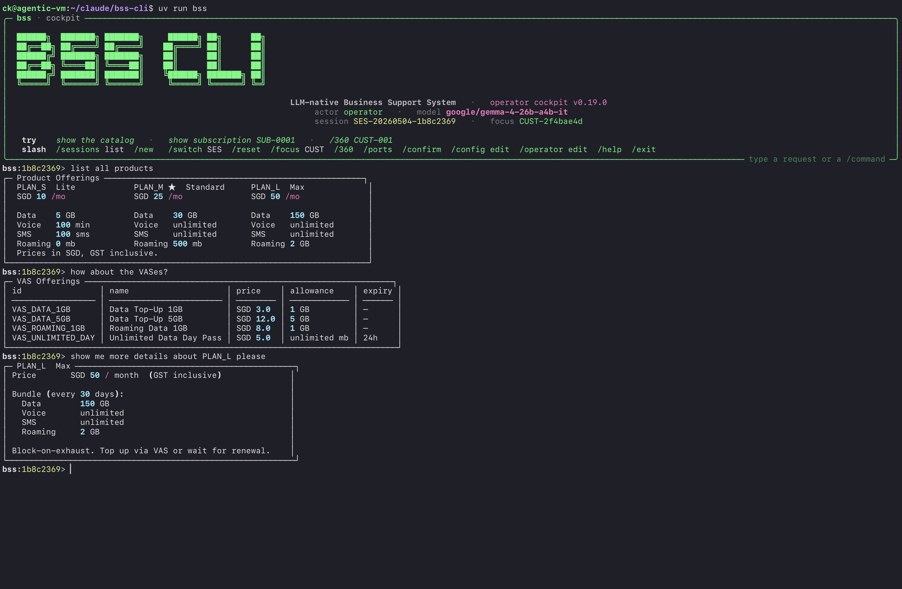
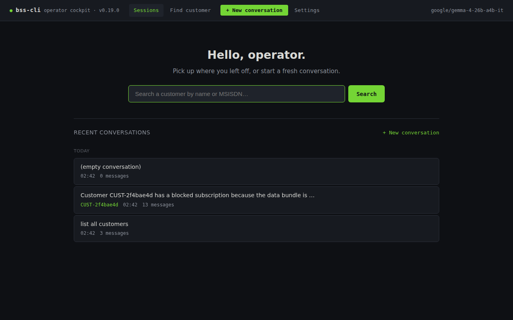
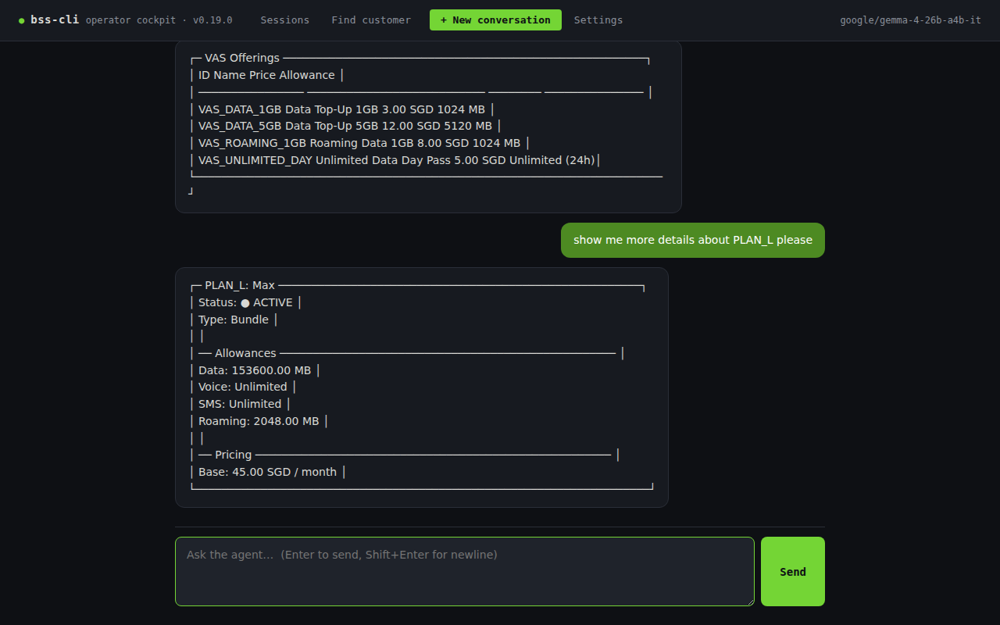
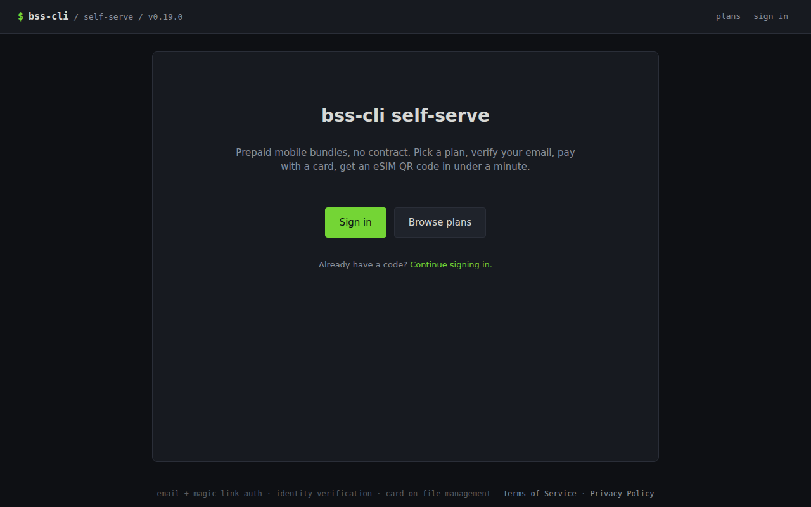
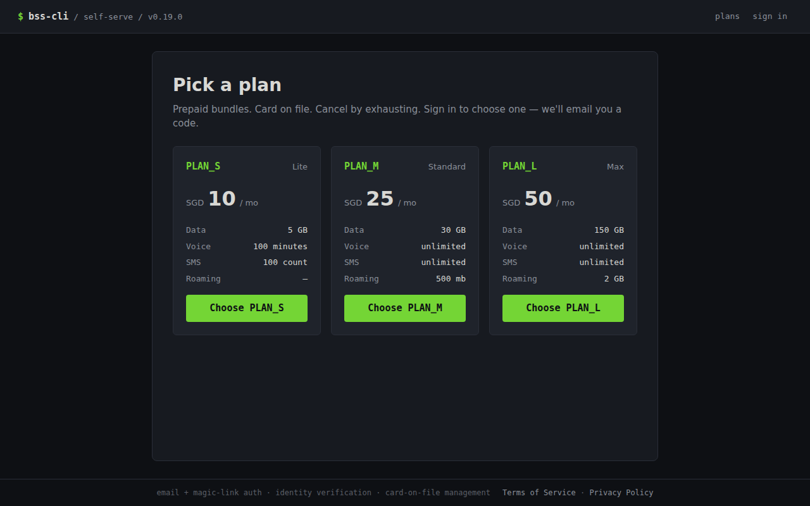

# BSS-CLI

> The entire BSS, in a terminal. SID-aligned. TMF-compliant. LLM-native. eSIM-first.

A complete reference Business Support System for a small mobile prepaid MVNO that runs from a single terminal command. Ten TMF-compliant service containers (Catalog, CRM with Cases/Tickets/Port-requests, Payment, COM, SOM, Subscription, Mediation, Rating, Provisioning-sim) plus two web portals (self-serve customer + operator cockpit). Every operation is a tool the LLM can call; the primary UI is the `bss` CLI plus ASCII visualizations and a scoped chat surface in the customer portal.

For engineers learning telco BSS/OSS, for a small MVNO that wants a deployable MVP, and as a substrate for agentic experiments against realistic telco operations. **eSIM-only, bundled-prepaid, block-on-exhaust, card-on-file mandatory.** eKYC, real-customer UI, network elements, batch CDR, and OCS protocols are intentionally out of scope (channel-layer concerns).

**Status (v0.19 baseline, soaking toward v1.0):** all three real-provider integrations are live (Resend email, Didit KYC, Stripe Checkout). Telco hygiene gaps are closed (MNP port-in/port-out, MSISDN replenishment, roaming as a product). Renewals fire automatically on their period boundary via an in-process worker; customers get a reminder email ~24h before. The operator cockpit runs single-operator-by-design behind a secure perimeter — REPL canonical, browser veneer over the same Postgres-backed `Conversation` store. The only mocked surface left for v1.0 is SM-DP+ (real eSIM provisioning is NDA-gated).

## Screenshots

### Operator cockpit — REPL (canonical surface)

The `bss` REPL is the cockpit. Type natural language; the agent calls tools; results render as ASCII cards. Slash commands (`/ports`, `/360`, `/focus`, `/confirm`) cover deterministic operator flows.



### Operator cockpit — browser veneer

Same `Conversation` store as the REPL; exit `bss`, open `localhost:9002`, see the same turns. No login wall (single-operator-by-design behind a secure perimeter).

- **Sessions index** — `localhost:9002/`. Recent conversations + customer search + new-conversation CTA.

  

- **Live conversation** — agent renders ASCII tool cards inline (catalog VAS list, plan detail, etc.). Destructive actions propose first, wait for `/confirm`.

  

### Self-serve portal (customer-facing)

- **Public landing** — `localhost:9001/welcome`.

  

- **Plan picker** — `localhost:9001/plans`. Three plans, all four allowance rows aligned (Data / Voice / SMS / Roaming). PLAN_S has no roaming included; PLAN_M ships 500 mb, PLAN_L ships 2 GB.

  

### Distributed trace (`bss trace`)

- **Signup chain swimlane** — every span across COM → SOM → Inventory → Provisioning-sim → Subscription → Payment, ASCII rendered:

  

> Re-capture against your own stack: `uv run python docs/screenshots/capture_portals.py` for the web surfaces; see [`docs/screenshots/CAPTURE.md`](docs/screenshots/CAPTURE.md) for prereqs and the manual REPL capture.

## How writes flow

Every BSS write goes through the per-service policy layer. Three trigger paths feed it:

- **Direct via `bss-clients`** — every CLI/REPL command, the entire signup funnel, every post-login self-serve route, and every read. Sub-second, deterministic, no LLM.
- **Orchestrator-mediated via `astream_once`** — the customer-portal chat surface (only orchestrator-mediated route post-v0.11). Wraps a LangGraph ReAct agent over the same tool registry. The same policy chokepoint enforces both paths, so audit + attribution stay coherent.
- **In-process tick loops** — the v0.18 renewal worker fires automatic renewals and sends upcoming-renewal reminder emails on a 60-second tick. `FOR UPDATE SKIP LOCKED` makes it multi-replica safe by construction.

The audit log gets a coherent attribution on every write: `actor`, `channel` (`portal-self-serve` / `portal-csr` / `portal-chat` / `cli` / `system:renewal_worker`), and `service_identity` (`portal_self_serve` / `default` / etc. via the v0.9 named-token perimeter).

## What's in the box (v0.7 → v0.18)

| Release | What landed |
|---|---|
| **v0.7** | Catalog versioning + plan changes; subscription price snapshotted at order time; renewal reads the snapshot, not the catalog |
| **v0.8** | Self-serve portal authentication — email + magic-link / OTP, server-side sessions, public-route allowlist, step-up scaffolding |
| **v0.9** | Named tokens at the BSS perimeter; `service_identity` propagation through audit + structlog + OTel |
| **v0.10** | Authenticated post-login customer self-serve writes go direct (chat stays orchestrator-mediated); per-resource ownership policies + step-up gating |
| **v0.11** | Signup funnel goes direct (sub-second per step). Chat is the only orchestrator-mediated route |
| **v0.12** | Chat scoping — `customer_self_serve` profile + `*.mine` wrappers + ownership trip-wire + per-customer caps + 5-category escalation. 14-day soak |
| **v0.13** | Operator cockpit. CLI REPL canonical, browser veneer over a shared Postgres-backed `Conversation` store. v0.5 staff-auth retired |
| **v0.14** | Real-provider integration arc begins: per-domain adapter Protocols, `integrations` schema for forensic external-call + webhook-event logging, ResendEmailAdapter for transactional auth mail |
| **v0.15** | KYC (Didit) + the eSIM-provider seam. Channel-layer KYC; BSS only verifies signed attestations + corroboration |
| **v0.16** | Payment (Stripe Checkout + webhook reconciliation). PCI scope guard refuses to boot in production-stripe mode if a card-number `<input>` survives in any rendered template |
| **v0.17** | Telco hygiene release. MNP (port-in / port-out via `crm.port_request`), MSISDN replenishment (`bss inventory msisdn add-range` + low-watermark event), roaming as a product (`data_roaming` allowance type, `VAS_ROAMING_1GB` top-up) |
| **v0.18** | Automated subscription-renewal worker. Three sweeps per tick: renew due / skip blocked-overdue / send upcoming-renewal email. Multi-replica safe via `FOR UPDATE SKIP LOCKED` from day one |

Full per-release narratives in [`phases/V0_X_Y.md`](phases/). What's left for v1.0 is in [`ROADMAP.md`](ROADMAP.md).

## Quick start

### Prerequisites

- Docker + Docker Compose
- Python 3.12 + [uv](https://docs.astral.sh/uv/)
- An OpenRouter API key (or any OpenAI-compatible endpoint) for the orchestrator-mediated chat + REPL

### Bring-your-own-infra (BYOI — Postgres / RabbitMQ already running)

```bash
git clone <repo>
cd bss-cli
cp .env.example .env

# Generate a real BSS_API_TOKEN; the sentinel value rejects on startup.
sed -i "s/^BSS_API_TOKEN=changeme$/BSS_API_TOKEN=$(openssl rand -hex 32)/" .env

# Edit .env: BSS_DB_URL, BSS_RABBITMQ_URL, BSS_LLM_API_KEY,
# optionally BSS_OTEL_EXPORTER_OTLP_ENDPOINT (e.g. http://tech-vm:4318)

docker compose up -d         # 10 services + 2 portals
make migrate                  # Alembic on the existing Postgres (currently at 0021)
make seed                     # 3 plans + 4 VAS offerings + 1000 MSISDNs + 1000 eSIM profiles
bss                           # opens the cockpit REPL
```

### All-in-one (bundled infra)

```bash
docker compose -f docker-compose.yml -f docker-compose.infra.yml up -d
make migrate
make seed
bss                                 # cockpit REPL
open http://localhost:9001/         # self-serve portal
open http://localhost:9002/         # operator cockpit (browser veneer)
open http://localhost:16686/        # Jaeger UI (traces)
open http://localhost:3000/         # Metabase (analytics)
```

### First commands worth running

```bash
make scenarios                   # 17 hero scenarios — sanity-check the install (~95s)
make doctrine-check              # 14 grep guards (clock, OTel, channel, renewal worker, ...)
bss subscription show SUB-0001
bss inventory msisdn list --prefix 9000 --limit 5
bss trace for-order ORD-0001
```

## Documentation map

- [`CLAUDE.md`](CLAUDE.md) — project doctrine; read first
- [`ARCHITECTURE.md`](ARCHITECTURE.md) — topology, call patterns, deployability matrix, AWS deployment path
- [`DATA_MODEL.md`](DATA_MODEL.md) — schemas + tables + relationships
- [`TOOL_SURFACE.md`](TOOL_SURFACE.md) — every LLM tool with arg shape and return shape
- [`DECISIONS.md`](DECISIONS.md) — non-obvious architectural choices, append-only
- [`CONTRIBUTING.md`](CONTRIBUTING.md) — phase discipline, DECISIONS pattern, test conventions
- [`ROADMAP.md`](ROADMAP.md) — shipped + what's left for v1.0 + future + non-goals
- [`phases/`](phases/) — per-release build plans (PHASE_01 → PHASE_10, V0_2_0 → V0_18_0)
- [`docs/runbooks/`](docs/runbooks/) — operational procedures (Jaeger BYOI, API token rotation, snapshot regen, MNP port flows, Stripe cutover, payment idempotency, chat ownership trip, chat caps, chat-escalated case triage, chat transcript retention, three-provider sandbox soak)

## Tracing with `bss trace`

Every service exports OpenTelemetry traces to Jaeger. Read them three ways:

```bash
bss trace for-order ORD-0014           # ASCII swimlane in the terminal — see screenshot
bss trace for-subscription SUB-0007
bss trace get 4a8f9e2c0123…            # by trace id

open http://localhost:16686/            # all-in-one — Jaeger UI
open http://tech-vm:16686/              # BYOI; see docs/runbooks/jaeger-byoi.md
```

For BYOI installs, run a single-container Jaeger on a separate host and point `BSS_OTEL_EXPORTER_OTLP_ENDPOINT` at it. The full ASCII swimlane is taller than the cropped README screenshot — run the command in your terminal to see every span.

## Hero scenarios

Living regression suite under `scenarios/*.yaml`. **17 scenarios tagged `hero`** as of v0.18 — every release adds one for the headline feature. Each scenario starts with `admin.reset_operational_data` + `clock.freeze_at` for determinism.

```bash
make scenarios                                 # all 17 (~95s wall clock)
bss scenario list scenarios                    # inventory
bss scenario validate scenarios/*.yaml         # parse-check
bss scenario run scenarios/<name>.yaml         # single run
bss scenario run-all scenarios --tag hero      # tag-filtered
```

LLM-driven scenarios (the few that ask the agent to reason rather than dispatch deterministically) should pass three runs in a row before tagging — model variance is real and the gate exists to catch flakes.

### v0.12 14-day soak

`scenarios/soak/run_soak.py` provisions N synthetic customers and runs them in parallel for D simulated days under an accelerated frozen clock. Each customer fires events probabilistically (10% dashboard / 5% chat / 1% escalation / 0.5% top-up / 0.1% cross-customer probe). Soak gates: zero ownership-check trips, zero cross-customer leaks, chat-usage drift ≤ 5%, p99 chat latency under 5s (alarm at 15s), bounded transcript-table growth.

```bash
# Smoke (validates wiring; ~1 min wall clock)
uv run python -m scenarios.soak.run_soak --customers 2 --days 1

# Substantive run (default report path: soak/report-v0.12.md)
uv run python -m scenarios.soak.run_soak --customers 30 --days 14
```

The v0.12 baseline run is checked in at [`soak/report-v0.12.md`](soak/report-v0.12.md). A soak re-run on v1.0 is the public-cohort gate before tagging.

## License

Apache-2.0
